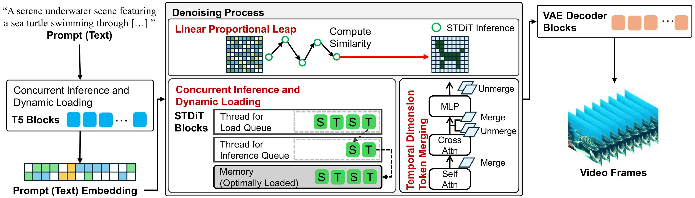

# On-Device-Sora
# [Mobisys 2025] On-device Sora: Enabling Diffusion-Based Text-to-Video Generation for Mobile Devices

The paper is currently under review.
* Code is based on implementation of [Open-Sora](https://github.com/hpcaitech/Open-Sora)

Code implementation of  [MobiSys 2025] On-device Sora: Enabling Diffusion-Based Text-to-Video Generation for Mobile Devices.
Base code referred ->
Open-Sora : Democratizing Efficient Video Production for All

## Introduction

This repository provides code for *On-device Sora*, which is an open-sourced implementation of paper named *On-device Sora: Enabling Diffusion-Based Text-to-Video Generation for Mobile Devices*. 

Instruction to Team 2: 각 부분에 대한 소개를 부탁드립니다.  

### On-Device Sora
*On-device Sora* applies Linear Proportional Leap (LPL), Temporal Dimension Token Merging (TDTM), and Concurrent Inference with Dynamic Loading (CI-DL) to enable efficient video generation on the iPhone 15 Pro.



### Open-Sora

[Open-Sora](https://github.com/hpcaitech/Open-Sora) is a baseline model of On-Device Sora, an open-source project for video generation, and a T2V Diffusion model that can produce videos based on text input.

## How to convert each model to mlpackage for On-device Sora

## Package Dependencies

### Dependency 
```
cd convert-On-device

conda create -n convert python=3.10

conda activate convert

pip install -r requirements/requirements-convert.txt

pip install -v .
```


### T5 Converting
```
cd t5
python3 export-t5.py
```

### STDiT Convering
```
cd stdit3
python3 export-stdit3.py
```

### VAE Converting
When you run `export-vae-spatial.py`, There are some error that is `Fatal Python error: PyEval_SaveThread`.
To address this error, you should only run one code block for each VAE part. Comment out the rest.

```
cd vae

# for vae's temporal part
python3 export-vae-temporal.py

# for vae's spatial part
python3 export-vae-spatial.py
```

## How to Use

### Required

1. iPhonne: over iPhone 15 pro
2. iOS version: over 18
3. All mlpackages (T5, STDiT, VAE)

### Download converted MLPackage

You can download and use the converted models from the following link. [[Download](https://drive.google.com/drive/folders/1L6pVi3KmyLygR_pvKofRL-21adKsEb4p?usp=sharing)]


### Example artifacts

### Figures


